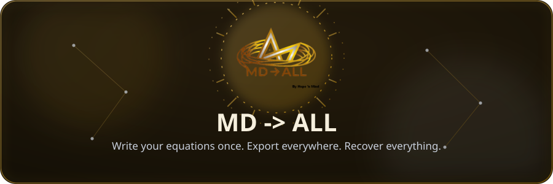
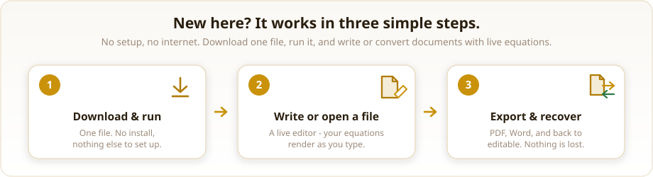
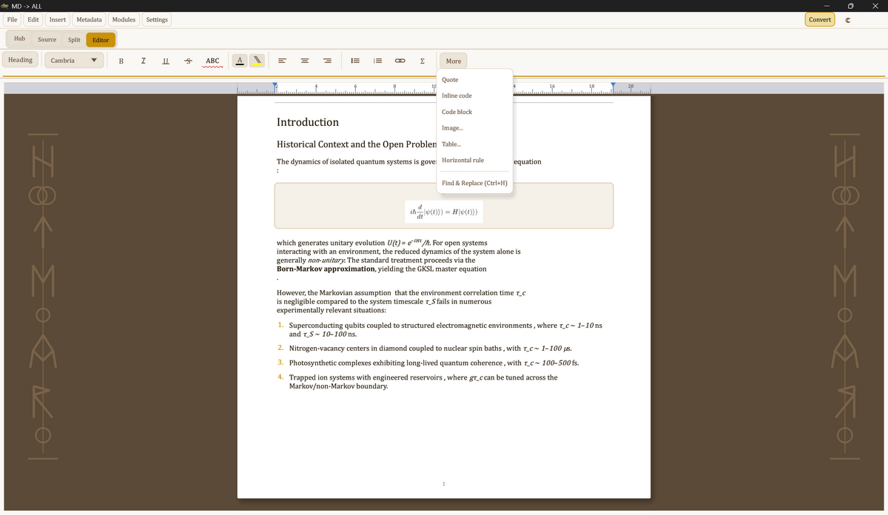
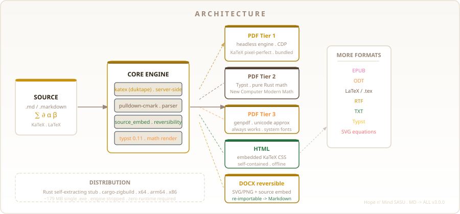
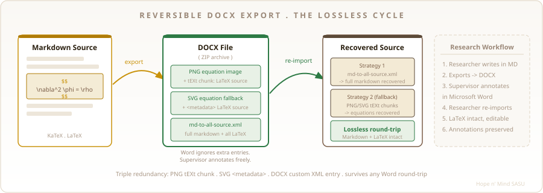
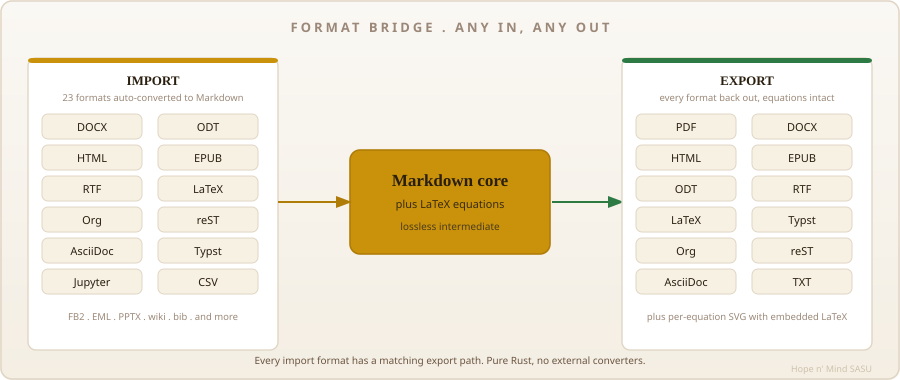
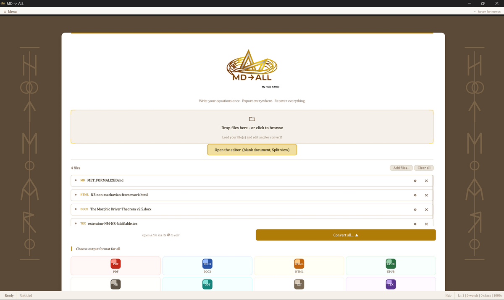

<p align="center">
   ALL">
</p>

<p align="center">
  
  
  
  
</p>

# MD -> ALL

 **MD -> ALL is a writing app for documents that contain equations.** Write or open a file, watch your formulas appear properly as you type, then save it as a PDF, a Word document, a web page and more. It looks and behaves like an ordinary word processor.


<a id="overview"></a>


 A self-contained scientific Markdown editor. Write documents with equations, watch them render live, and export to any format without losing a symbol.

<p align="center">
  
</p>

<p align="center">
   ALL editor">
</p>

*The editor: three live views, with LaTeX rendered in place.*

- **No experience needed.** You do not have to code, and no technical syntax is ever forced on you.
- **Nothing to set up.** One download for your computer (Windows, Mac or Linux). No account, no internet, no extra software to install.
- **Your maths stays perfect.** A Word file you export can be reviewed in Word and then turned back into your editable document, with every equation intact.

**How to get it:** open the [**Download**](#install) section below and click the file for your system. That is the whole setup.

> *New to GitHub? This page is only where the app is stored, so you do not need an account or any knowledge of the site. The download links below are all you need.*

> **MD -> ALL** is a self-contained scientific Markdown editor with full LaTeX/KaTeX rendering and lossless multi-format export. No runtime, no install prerequisites: download one executable, run it, everything works.

<div align="center">
  
</div>


<a id="reversible-docx"></a>


 DOCX export is not destructive. Every equation survives a full Word round trip and can be recovered perfectly.

<p align="center">
  
</p>

The core innovation: **DOCX export is not destructive**. Every LaTeX equation is preserved in three independent redundant locations inside the file, so the original Markdown + LaTeX source can be recovered perfectly after any Word round-trip.

| Layer | Location | Survives |
|---|---|---|
| **Primary** | `md-to-all-source.xml` custom ZIP entry | Word open/save, annotation, track changes |
| **Secondary** | PNG `tEXt` ancillary chunk (`LaTeX: ...`) | Image extraction, copy-paste |
| **Tertiary** | SVG `<metadata>` CDATA block | SVG re-use, vector export |

**Workflow**: Researcher writes in MD -> ALL, exports DOCX, supervisor annotates in Word, researcher re-imports in MD -> ALL, original Markdown + all LaTeX equations recovered intact.


<a id="equation-history"></a>


 Every equation edit is logged locally and timestamped, so any version can be reverted in a click.

Every equation edit is logged locally and timestamped, per document, under `%APPDATA%/MD-ALL/history/`. Toggle the **History** panel from the view bar: each equation shows its change count; expand one to see every version and **revert** to any of them in a click. The same log is exposed over MCP (`equation_history` / `equation_revert` / `equation_lint` / `equation_fix`), so an agent can audit, revert, or auto-fix equations on its own. It is the temporal companion to the reversible DOCX: that recovers the *current* source from a shared file; this keeps *every past version*, locally.


<a id="export-formats"></a>


 Twelve export formats share one pipeline, from pixel-perfect PDF to plain text.

<p align="center">
  
</p>

| Format | Quality | LaTeX rendering | Notes |
|---|---|---|---|
| **PDF** (Tier 1) | best | KaTeX pixel-perfect | Bundled headless rendering engine |
| **PDF** (Tier 2) | high | Typst, New Computer Modern Math | Pure Rust, zero system deps |
| **PDF** (Tier 3) | basic | Unicode approximation | genpdf fallback, always works |
| **HTML** | best | KaTeX, server-side rendered | Self-contained, embedded CSS, offline |
| **DOCX** | high | SVG/PNG equations | **Reversible**, re-importable to Markdown |
| **ODT** | high | PNG equations | LibreOffice compatible |
| **EPUB** | high | PNG equations | E-reader compatible |
| **LaTeX** | best | Native pass-through | `.tex` source, equation-preserving |
| **Typst** | best | Native conversion | Auto-converted LaTeX -> Typst math |
| **RTF** | basic | Unicode approximation | Word/legacy compatible |
| **TXT** | basic | Unicode approximation | Plain text, always readable |
| **SVG** | best | Vector equations | Per-equation, embeds LaTeX source |


<a id="latex-support"></a>


 MD -> ALL accepts LaTeX exactly as researchers write it, in any delimiter, environment, or mixed notation.

MD -> ALL handles LaTeX in all its forms, as written by researchers in real scientific papers:

```latex
% Display math: all delimiters recognized
$$  \nabla^2 \phi = \frac{\rho}{\varepsilon_0}  $$

\[  \int_0^\infty e^{-x^2} dx = \frac{\sqrt{\pi}}{2}  \]

% Inline math
The energy $E = mc^2$ where $m$ is rest mass.

\( \hat{H}\psi = E\psi \)

% Environments
\begin{align}
  \dot{x} &= \sigma(y - x) \\
  \dot{y} &= x(\rho - z) - y
\end{align}

% Complex operators
\operatorname{softmax}(\mathbf{z})_i = \frac{e^{z_i}}{\sum_j e^{z_j}}

% Subscript notation
h_{\text{Center\_State}} = \tanh(W_{\text{fwd}} \cdot x_t)
```

**Normalization pipeline**: double-escaped LaTeX (`\\alpha`), markdown-escaped braces (`\{`), and mixed notation are all normalized automatically before rendering.


<a id="editor"></a>


 A full WYSIWYG editor, not a Markdown previewer. Edit the rendered document directly, or drop into a live source view, one keystroke apart.

<p align="center">
  
</p>

*Open a file straight into the editor, or batch-convert from the home hub.*

MD -> ALL is a full WYSIWYG document editor, not a Markdown previewer. It keeps three views, always one keystroke apart:

- **Editor** (default): the rendered document *is* the editing surface. Click, type, and format. No Markdown syntax in sight.
- **Split**: source and rendered editor side by side, each live and editable, each with its own toolbar.
- **Source**: a true code editor for the Markdown, with syntax highlighting, a line-number gutter, indent / comment / duplicate tools, and find and replace.

Editing in the rendered view writes back to the Markdown source in real time, and edits in the source flow back to the render the same way.

### What you can do

| Action | Result |
|---|---|
| Click an equation in the render | Equation editor opens on its LaTeX (display and inline) |
| Type in the rendered view | The Markdown source updates live |
| Select and format | Bold, italic, underline, strikethrough, super / subscript, code |
| Color, size, highlight | Per-selection text color, font size, and highlight |
| Insert a table | Visual grid editor: add or remove rows and columns, set per-column alignment; the cursor inside a table reopens it for editing |
| Insert an SVG | An SVG editor overlay mirroring Code / Visual / Split, with a snippets menu and a live render, inserted at the cursor |
| Drag an image onto the page | Copied beside the document under `assets/` and referenced automatically |
| Comment on a passage | Anchored to the selection, listed in the review panel, and saved beside the document |
| Open a DOCX annotated in Word | Tracked changes and comments surface in the review panel |
| Accessibility | WCAG controls: interface scale, high contrast, reduced motion, larger targets, selectable icon set |


<a id="mcp-server"></a>


 mdall-mcp exposes the whole conversion engine, including the lossless DOCX round trip, to any MCP client over stdio.

`mdall-mcp` exposes the MD -> ALL conversion engine to any MCP client (an
automation host that speaks the [Model Context Protocol](https://modelcontextprotocol.io))
over stdio. It runs headless, fully offline, and shares the editor's exact
conversion core, including the lossless DOCX round-trip. It is a separate,
self-contained binary: you can use it on its own, without the editor.

### Install

Pick one:

- **Download** `mdall-mcp-<platform>.zip` from the [releases](https://github.com/hopenmind/mdall/releases/latest) and unzip it.
- **Build** from source: `cargo build --release -p mdall-mcp` -> `target/release/mdall-mcp(.exe)`.

No runtime is required: it is a single executable. Note its absolute path.

### Configure your MCP client

Point any MCP-compatible client at the binary. The server speaks MCP over stdio
(newline-delimited JSON-RPC 2.0), so the configuration is just the command:

```json
{
  "mcpServers": {
    "mdall": {
      "command": "C:/path/to/mdall-mcp.exe"
    }
  }
}
```

### Tools

| Tool | Arguments | Returns |
|---|---|---|
| `list_formats` | (none) | Every import (45) and export (18) format the engine supports. |
| `convert_file` | `{ input, output }` | Converts by file extension. DOCX export stays reversible. |
| `import_to_md` | `{ input }` | Any document returned as Markdown (LaTeX preserved). |
| `export_md` | `{ markdown, output, title?, author?, base_dir? }` | Writes Markdown to a target format; resolves relative images against `base_dir`. |
| `recover_source` | `{ input }` | Recovers the original Markdown + LaTeX from a DOCX produced by MD -> ALL. |
| `equation_history` | `{ input }` | Every equation's timestamped edit log (the local "git for equations"). |
| `equation_revert` | `{ input, id, to }` | Revert an equation to a prior version (`origin` or a change `ts`); rewrites the `.md`. |
| `equation_lint` | `{ input }` or `{ markdown }` | Flags malformed equations (unbalanced braces, mismatched `\left`/`\right`). |
| `equation_fix` | `{ input, id? }` | Auto-corrects malformed equations and records each fix (revertible). |

Paths are absolute. `convert_file` and `export_md` infer the target format from
the output extension (`.pdf`, `.docx`, `.html`, `.typ`, `.epub`, `.odt`, `.rtf`,
`.tex`, `.md`, ...). PDF uses the bundled engine when present and otherwise the
pure-Rust Typst tier, so it works with the standalone MCP binary too.

### The reversibility feature

`recover_source` is the differentiator: a DOCX exported by MD -> ALL embeds its
original Markdown + equation LaTeX in three redundant layers, so even after a
reviewer annotates it in Word, the exact editable source comes back.

```
author MD  --convert_file-->  paper.docx  --(annotated in Word)-->  paper.docx
                                                                        |
                              recover_source  <------------------------ /
                                    |
                              original Markdown + LaTeX, intact
```

### Protocol (manual test)

Transport is newline-delimited JSON-RPC 2.0 on stdin/stdout; the server speaks
MCP revision `2024-11-05`. You can drive it by hand, one JSON object per line:

```jsonc
{"jsonrpc":"2.0","id":1,"method":"initialize","params":{}}
{"jsonrpc":"2.0","id":2,"method":"tools/list"}
{"jsonrpc":"2.0","id":3,"method":"tools/call","params":{"name":"convert_file","arguments":{"input":"/abs/in.md","output":"/abs/out.pdf"}}}
{"jsonrpc":"2.0","id":4,"method":"tools/call","params":{"name":"recover_source","arguments":{"input":"/abs/out.docx"}}}
```


<a id="zero-deps"></a>


 One file, no VC++ runtime, no .NET, no Node, no Python, no internet at runtime.

MD -> ALL is fully self-contained. The end user downloads **one file**, runs it, and everything works.

```
mdall-3.0.0-x64-installer.exe   (~179 MB)
|
+-- mdall.exe                    (34 MB, Rust binary)
|   +-- KaTeX engine    (duktape JS, compiled in)
|   +-- Typst 0.11      (math engine, compiled in)
|   +-- New CM Math     (OpenType MATH font, compiled in)
|   +-- All export logic (PDF/HTML/DOCX/EPUB/ODT/TeX/RTF/TXT)
|
+-- rendering engine                 (headless PDF only, stripped)
    installed into a private application folder,
    never placed next to the app
```

- No VC++ Runtime required
- No .NET required
- No Node.js, no Python
- No external browser to install
- No internet access at runtime


<a id="build-platforms"></a>


 Build from source with a couple of PowerShell scripts, and ship to Windows, Linux and macOS from the same CI.

**Getting started, development**

```powershell
# 1. Clone
git clone https://github.com/hopenmind/mdall
cd mdall

# 2. Download the bundled rendering engine (one-time, ~400 MB)
.\scripts\setup-engine.ps1

# 3. Run
cargo run

# 4. Build release binaries for every target (x64 + ARM64)
.\scripts\build-all.ps1

# 5. Build the self-contained installer
.\scripts\make-installer.ps1
```

**Platform support**

| Target | Triple | Bundled PDF engine | Status |
|---|---|---|---|
| Windows x64 | `x86_64-pc-windows-msvc` | bundled (hidden by installer) | Supported, primary |
| Linux x64 | `x86_64-unknown-linux-gnu` | bundled rendering engine | Supported |
| macOS arm64 | `aarch64-apple-darwin` | bundled rendering engine | Supported |

Every target is built natively by CI (`.github/workflows/release.yml`) on
GitHub's own runners, so no local cross toolchain is needed: push a `vX.Y.Z` tag
and the bundles are produced for you. The GUI embeds a serif (New Computer
Modern) so it renders with no system font installed, and PDF export always falls
back to the pure-Rust Typst tier where a bundled engine is unavailable. The PDF
engine is selectable in-app under Options (Native or General converter).

Windows ARM64 is on hold: the KaTeX JS engine (duktape) does not compile on
`aarch64-pc-windows-msvc`, so that target awaits an alternative JS backend.


<a id="under-the-hood"></a>


 A three-tier PDF cascade guarantees output on every platform, on top of a pure-Rust technical stack.

**PDF export, three-tier cascade**

```
Export PDF triggered
       |
       v
+---------------------------------------------+
| Tier 1: bundled rendering engine            |  <- Best quality
|   HTML (KaTeX pre-rendered) -> engine -> PDF|     Pixel-perfect math
|   Bundled binary, no system browser needed  |
+------------------+--------------------------+
         fails?    |
                   v
+---------------------------------------------+
| Tier 2: Typst pure-Rust                     |  <- Excellent quality
|   Markdown -> Typst source -> PDF in memory |     New Computer Modern Math
|   Zero system dependencies                  |
+------------------+--------------------------+
         fails?    |
                   v
+---------------------------------------------+
| Tier 3: genpdf fallback                     |  <- Always works
|   LaTeX -> Unicode approximation -> PDF     |     System fonts (Segoe/Arial)
+---------------------------------------------+
```

**Technical stack**

| Component | Technology |
|---|---|
| GUI | egui 0.29 / eframe (immediate-mode, pure Rust) |
| Markdown | pulldown-cmark 0.12 |
| KaTeX (server-side) | `katex` crate + duktape JS engine |
| Math equations (preview) | Typst 0.11 + `typst-render` to PNG |
| PDF Tier 1 | headless rendering engine (CDP) |
| PDF Tier 2 | `typst-pdf` 0.11 |
| PDF Tier 3 | `rckive-genpdf` 0.4 |
| DOCX / ODT | `zip` crate, raw OpenDocument XML |
| EPUB | `epub-builder` 0.7 |
| DOCX reversibility | PNG tEXt CRC-32 / SVG `<metadata>` / DOCX custom ZIP entry |
| Cross-compilation | `cargo-zigbuild` + Zig linker |
| Installer | Rust self-extracting stub (payload appended to exe tail) |


<a id="install"></a>


 Download the self-contained app for your platform, or just the headless MCP server if you only need conversion.

<p align="center">
  <a href="https://github.com/hopenmind/mdall/releases/latest/download/mdall-win-x64.zip"></a>
</p>

| Platform | File |
|---|---|
| Windows x64 | [mdall-win-x64.zip](https://github.com/hopenmind/mdall/releases/latest/download/mdall-win-x64.zip) |
| Linux x64 | [mdall-linux-x64.zip](https://github.com/hopenmind/mdall/releases/latest/download/mdall-linux-x64.zip) |
| macOS (Apple Silicon) | [mdall-macos-arm64.zip](https://github.com/hopenmind/mdall/releases/latest/download/mdall-macos-arm64.zip) |

The full app is self-contained: binaries plus a bundled PDF engine, ready to run. If you only need conversion, the headless MCP server is a lighter download:

| Platform | Download |
|---|---|
| Windows x64 | [mdall-mcp-win-x64.zip](https://github.com/hopenmind/mdall/releases/latest/download/mdall-mcp-win-x64.zip) |
| Linux x64 | [mdall-mcp-linux-x64.zip](https://github.com/hopenmind/mdall/releases/latest/download/mdall-mcp-linux-x64.zip) |
| macOS (Apple Silicon) | [mdall-mcp-macos-arm64.zip](https://github.com/hopenmind/mdall/releases/latest/download/mdall-mcp-macos-arm64.zip) |

All versions and changelogs: [github.com/hopenmind/mdall/releases](https://github.com/hopenmind/mdall/releases)


<a id="limitations"></a>


 **Windows ARM64 is on hold.** The KaTeX JS engine (duktape) does not compile on aarch64-pc-windows-msvc, so that target awaits an alternative JS backend.

 **PDF quality degrades gracefully, not silently.** When the bundled rendering engine and the pure-Rust Typst tier are both unavailable, PDF export falls back to a Unicode approximation with system fonts.


<p align="center">[License](LICENSE) &nbsp;&middot;&nbsp; [Notices](NOTICES.md)</p>

<p align="center"><sub>(c) 2024-2026 Hope 'n Mind SASU. All rights reserved. Research use permitted with attribution.</sub></p>

<br>

<p align="center"><sub>MD -> ALL is published by <b>Hope 'n Mind SASU</b></sub></p>
<p align="center"></p>
<p align="center"><sub>SIREN 938 261 310 &middot; RCS Brest &middot; contact@hopenmind.com &middot; hopenmind.com</sub></p>

<p align="center"><em>Write your equations once. Export everywhere. Recover everything.</em></p>
